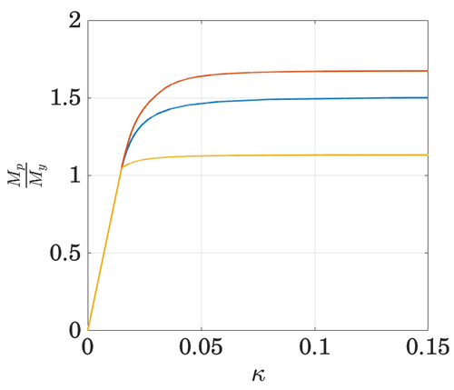

Moment-Curvature
==================
This script computes the moment curvature diagram for different cross sections

The provided sections are
  * Rectangular
  * Circular
  * Wide Flange

The material is assumed to be elastic perfectly-plastic

Theory and Documentation 
========================
*Fundamentals of Structural Analysis*, Danilo S. Kusanovic, 2023.
